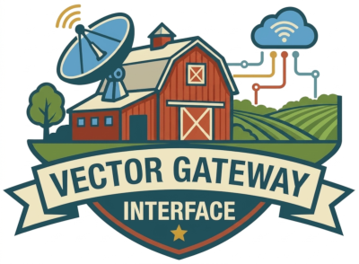

<p align="center">
  
</p>

<h1 align="center">vgi-java</h1>

<p align="center">
  Serve <a href="https://duckdb.org/">DuckDB</a> catalogs, tables, and functions from a Java process over <a href="https://arrow.apache.org/">Apache Arrow</a> IPC — the Java implementation of the <a href="https://github.com/Query-farm/vgi">VGI (Vector Gateway Interface)</a> protocol.<br>
  Built by <a href="https://query.farm">🚜 Query.Farm</a>
</p>

<p align="center">
  <a href="https://central.sonatype.com/artifact/farm.query/vgi"></a>
  <a href="LICENSE"></a>
</p>

VGI lets DuckDB `ATTACH` a catalog whose schemas, tables, and functions live in an external worker process. The [vgi DuckDB extension](https://github.com/Query-farm/vgi) speaks an Arrow-IPC RPC protocol to that worker; this library is everything you need to write the worker side in Java. Your code registers functions and tables against a `Worker` builder — the library handles the wire protocol, schema negotiation, batch streaming, pushdown, and transports.

Wire-compatible with the [Python reference implementation](https://github.com/Query-farm/vgi-python) and the [Go port](https://github.com/Query-farm/vgi-go): all three serve the same integration suite against the same C++ extension.

## What you can serve

- **Catalog tables** — named tables with inline schemas, comments, tags, constraints, foreign keys, and per-column statistics that feed DuckDB's optimizer.
- **Scalar functions** — annotation-driven (`ScalarFn`): declare a `compute()` method and the parameter annotations generate the spec, bind-time validation, and dispatch.
- **Table functions** — streaming producers with projection pushdown, filter pushdown, row-id, sampling, and time-travel (`AT`) support.
- **Table-in/out functions** — exchange-style streaming transforms over input batches.
- **Table buffering functions** — sink/source functions that buffer all input before emitting (distributed-aggregation style lifecycles: process → combine → finalize).
- **Aggregate functions** — partial aggregation with cross-process state combine.
- **Catalog versioning** — semver data/implementation version negotiation, release manifests, multi-branch tables, transactions, and attach options.

## Requirements

- **Java 21+** at runtime. The shared-memory side-channel (zero-copy batch transfer with a co-located DuckDB) additionally requires **JDK 22+**; on 21 it transparently falls back to pipe transport.
- The [vgi extension](https://github.com/Query-farm/vgi) loaded in DuckDB on the client side.

## Installation

Artifacts are published to Maven Central under the `farm.query` group.

**Gradle (Kotlin DSL):**

```kotlin
dependencies {
    implementation("farm.query:vgi:0.1.0")
}
```

**Maven:**

```xml
<dependency>
  <groupId>farm.query</groupId>
  <artifactId>vgi</artifactId>
  <version>0.1.0</version>
</dependency>
```

The RPC layer ([`farm.query:vgirpc`](https://github.com/Query-farm/vgi-rpc-java)) comes in transitively.

## Quickstart

A worker with one scalar function:

```java
import farm.query.vgi.Worker;
import farm.query.vgi.scalar.Const;
import farm.query.vgi.scalar.ScalarFn;
import farm.query.vgi.scalar.Vector;
import org.apache.arrow.vector.BigIntVector;

public final class DemoWorker {

    /** {@code multiply(value INT64, factor INT64 [const]) -> INT64} */
    static final class Multiply extends ScalarFn {
        @Override public String name() { return "multiply"; }
        @Override public String description() { return "Multiplies a value by a constant factor"; }

        public void compute(@Vector BigIntVector value, @Const long factor, BigIntVector result) {
            int rows = value.getValueCount();
            for (int i = 0; i < rows; i++) {
                if (value.isNull(i)) {
                    result.setNull(i);
                } else {
                    result.set(i, value.get(i) * factor);
                }
            }
        }
    }

    public static void main(String[] args) {
        Worker worker = Worker.builder()
                .catalogName("demo")
                .registerScalar(new Multiply());
        worker.runFromArgs(args); // stdio by default; --unix / --http via flags
    }
}
```

The `compute()` signature drives everything: `@Vector` parameters are per-row input columns, `@Const` parameters are bind-time constants, `@Setting` parameters read session settings, and the last unannotated Arrow vector is the framework-allocated output.

**The worker JVM needs two flags** — Apache Arrow requires access to `java.nio` internals, and the shared-memory transport uses the FFM API:

```
--add-opens=java.base/java.nio=org.apache.arrow.memory.core,ALL-UNNAMED
--enable-native-access=ALL-UNNAMED
```

With the Gradle `application` plugin, bake them into the start script so the worker binary is self-contained:

```kotlin
application {
    mainClass.set("DemoWorker")
    applicationDefaultJvmArgs = listOf(
        "--add-opens=java.base/java.nio=org.apache.arrow.memory.core,ALL-UNNAMED",
        "--enable-native-access=ALL-UNNAMED",
    )
}
```

Without the `--add-opens` flag the worker fails at first query with `Failed to initialize MemoryUtil`.

Attach and query it from DuckDB:

```sql
LOAD vgi;
ATTACH 'demo' AS demo (TYPE vgi, LOCATION 'launch:/path/to/demo-worker');
SELECT demo.multiply(21, 2);  -- 42
```

The `launch:` location scheme starts the worker once behind a flock-coordinated Unix socket and reuses it across queries and DuckDB processes — essential for JVM workers, which are expensive to cold-start. Plain subprocess (`/path/to/worker`) and `http(s)://` locations also work.

## Example worker

The [`vgi-example-worker`](vgi-example-worker/) module (not published) is a complete worker with 90+ functions — scalar, table, aggregate, table-in/out, buffering, partitioned, multi-branch, transactional — that serves the canonical VGI integration suite. It is the best place to look for working patterns of any feature.

## Related projects

| Repository | What it is |
|---|---|
| [Query-farm/vgi](https://github.com/Query-farm/vgi) | The DuckDB extension (C++) — the client side of the protocol |
| [Query-farm/vgi-python](https://github.com/Query-farm/vgi-python) | Python reference implementation of the worker side |
| [Query-farm/vgi-go](https://github.com/Query-farm/vgi-go) | Go implementation of the worker side |
| [Query-farm/vgi-rpc-java](https://github.com/Query-farm/vgi-rpc-java) | The transport-agnostic Arrow RPC framework this library builds on |

## License

[Query Farm Source-Available License, Version 1.0](LICENSE).
